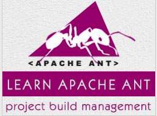

```
Roberto Nogueira  
BSd EE, MSd CE
Solution Integrator Experienced - Certified by Ericsson
```
# TutorialsPoint Ant



**About**

Learn everything you need to about the subject of this `Tutorialspoint` project.

[Homepage](https://www.tutorialspoint.com/ant/index.htm)

## Topics
```
Ant Tutorial
[ ] Home
[ ] Introduction
[ ] Environment Setup
[ ] Build Files
[ ] Property Task
[ ] Property Files
[ ] Data Types
[ ] Building Projects
[ ] Build Documentation
[ ] Creating JAR files
[ ] Creating WAR files
[ ] Packaging Applications
[ ] Deploying Applications
[ ] Executing Java code
[ ] Eclipse Integration
[ ] Junit Integration
[ ] Extending Ant
Ant Useful Resources
[ ] Quick Guide
[ ] Useful Resources
[ ] Discussion
Selected Reading
[ ] Developer's Best Practices
[ ] Questions and Answers
[ ] Effective Resume Writing
[ ] HR Interview Questions
[ ] Computer Glossary
[ ] Who is Who
```
